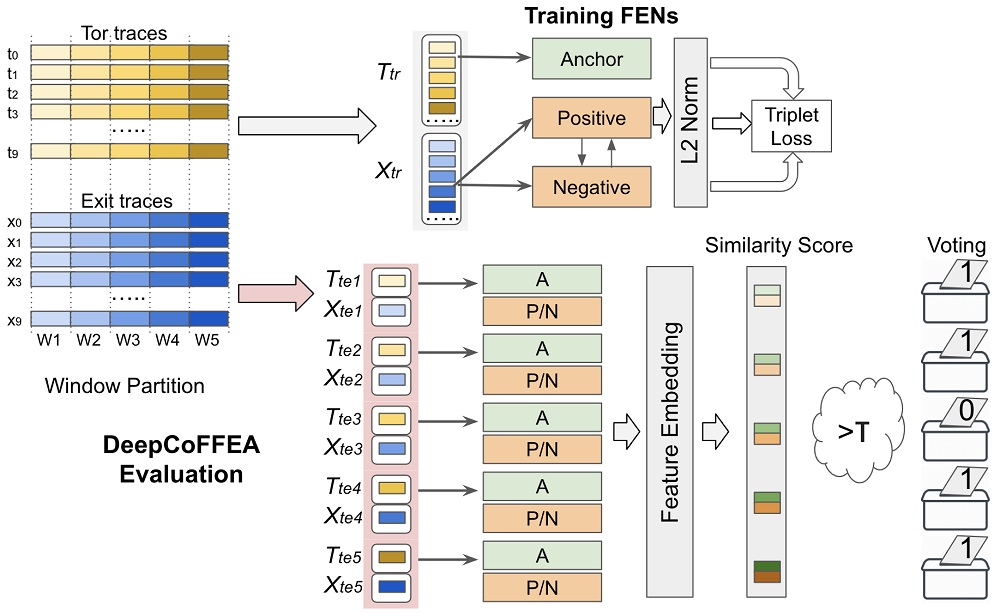

# DeepCoFFEA Attack
:warning: :warning: :warning: Experimental - **PLEASE BE CAREFUL**. Intended for Reasearch purposes ONLY. :warning: :warning: :warning:

This repository contains code and dataset of the **DeepCoFFEA: Improved Flow Correlation Attacks on Tor via Metric Learning and Amplification** paper accepted in ***IEEE Symposium on Security and Privacy (Oakland) 2022***. The code and dataset can be used to reproduce the results presented in the paper. [Read the Paper](https://www.computer.org/csdl/proceedings-article/sp/2022/131600b429/1A4Q4jvFYs0)


Figure: Example DeepCoFFEA Scenario: In this example, we had ten () low pairs and five windows (). First, we performed the non-overlapping window partition to generate two training sets, , and ten testing sets, . Then, we trained the DeepCoFFEA feature embedding network (FEN) with $T_{tr}$ and $X_{tr}$ and generated the feature embedding vectors using A and P/N models for each testing set, () where . We then computed the pairwise cosine similarity scores for each testing window and voted with 1 if the score was greater than  or 0 otherwise. Finally, we aggregated those results and determined that the flow pair was correlated if it had at least four 1 votes.

## Reference Format
```
@inproceedings{DeepCoFFEA,
  title={{DeepCoFFEA: Improved Flow Correlation Attacks on Tor via Metric Learning and Amplification}},
  author={Oh, Se Eun and Yang, Taiji and Mathews, Nate and Holland, James K and Rahman, Mohammad Saidur and Hopper, Nicholas and Wright, Matthew},
  booktitle={IEEE Symposium on Security and Privacy (S\&P)},
  year={2022},
  organization={IEEE}
}
```
## Prerequisite

GPU Support: We used Cuda10, Cudnn7.6.4

Python Version: Python 3.6.8

List of Python packages installed in our venv:

```
#Here is the result when running pip freeze over our venv

absl-py==0.8.1
astor==0.8.0
cycler==0.10.0
gast==0.3.2
google-pasta==0.1.7
grpcio==1.24.3
h5py==2.10.0
joblib==0.14.0
Keras==2.3.0
Keras-Applications==1.0.8
Keras-Preprocessing==1.1.0
kiwisolver==1.1.0
Markdown==3.1.1
matplotlib==3.1.1
mock==3.0.5
numpy==1.17.3
Pillow==6.2.1
protobuf==3.10.0
pyparsing==2.4.4
python-dateutil==2.8.1
PyYAML==5.1.2
scikit-learn==0.21.3
scipy==1.3.1
six==1.12.0
sklearn==0.0
tensorboard==1.13.1
tensorflow-addons==0.4.0
tensorflow-estimator==1.13.0
tensorflow-gpu==1.13.1
termcolor==1.1.0
tflearn==0.3.2
tfwn==1.0.1
tqdm==4.37.0
Werkzeug==0.16.0
wrapt==1.11.2
```

## How to run DeepCoFFEA ?

0. - Download our new data from [here](https://drive.google.com/file/d/1ZYFXfESD15SAR4Q8hsoVYdTHpTD8Orys/view?usp=sharing).
   The folder has files which are traces whose names are *circuit-index*_*site-index*. This mean, if files have same circuit_index in their names, they’re collected using the same circuit. Each line in the file consists of "*time_stamp*\t*packet_size*”. So you can split each line based on ‘\t’. For example, line.spilt(‘\t’)[0] is Time_stamp and line.spilt(‘\t’)[1] is pkt size. [Here](https://drive.google.com/drive/folders/1PG0sF6AHHn_2LxyoIztwjpoxDmB7r39z?usp=sharing) is window-separated data we already preprocessed and used in the paper (so with this data, you can **skip the bullet points, 1 and 2**)
   
   
   - Download timegap and 10k testing data from [here](https://drive.google.com/drive/folders/1JUC-KBghWX42yg19gYDcrospyuE16d6X?usp=sharing).
   
   - Download DeepCorr data from [here](https://drive.google.com/drive/folders/1Z4PyMCX99xME3T_LLvURejSfisP9jy4n?usp=sharing). 


1. Gather flow pairs whose packet counts > threshold per window. Before running code, modify line 82-86 as follows.

```
data_path = '/data/website-fingerprinting/datasets/CrawlE_Proc_100/' #input data path
out_file_path = '/data/seoh/CrawlE_Proc_100_files.txt' #output text file path to record flow pairs (i.e.,file_names)
threshold=20 # min number of packets per window in both ends
create_overlap_window_csv(data_path, out_file_path, threshold, 5, 11, 2) # We're using 11 windows and each window lasts 5 sec
```
Then, run the code
```
python filter.py
```
2. Create formatted-input pickles to feed them to triplet network.  Before running code, modify line 206-209 as follows.
```
data_path = '/data/website-fingerprinting/datasets/CrawlE_Proc/' #input data path
file_list_path = '/data/seoh/greaterthan50_final_burst.txt' # the path to txt file (we got from filter.py)
prefix_pickle_output = '/data/website-fingerprinting/datasets/new_dcf_data/crawle_new_overlap_interval' #output path
create_overlap_window_csv(data_path, file_list_path, prefix_pickle_output, 5, 11, 2) # We're using 11 windows and each window lasts 5 sec
```
Then, run the code. This code will create 11 pickle files in which each file carries the partial trace for each window.
```
python new_dcf_parse.py
```

3. Train FENs using pickle files created by new_dcf_parse.py. Configure the arguments as needed. For example,
```
--input: path to pickle files
--model: path to save the trained models
--test: path to save a testing set
```

```bash
python train_fens.py (--input <your_input_path> --model <your_model_path> --test <test_set_path>)
```

This script will save testing npz file in <test_set_path>, and trained models in <your_model_path>.

We stopped training when loss = 0.006 (DeepCorr set) and loss = 0.002 (our new set).

4. Evaluate trained FENs using trained two models and test dataset (eval_dcf.py). Configure arguments as needed. For example, 
```
--flow: number of flow pairs in the testing set (by default, use 2094)
--test: path to the testing set
--model1: path to the model 1 (tor embedding network)
--model2: path to the model 2 (exit embedding network)
--output: path to save the result ( it's formatted as [threshold|tpr|fpr|bdr])
```

```bash
python eval_dcf.py (--input <your_input_path> --model1 <your_model1_path> --model2 <your_model2_path> --output <your_output_path>)
```

The script above will generate TPRs, FPRs, and BDRs when using 9 out 11 window results. 


### Acknowledgements
We thank our anonymous reviewers for helpful suggestions and comments regarding the presentation and evaluation of DeepCoFFEA. We also thank Milad Nasr for sharing the code of Compressive Traffic Analysis and the DeepCorr set, and discussion about the data collection. We extend our appreciation to Erik Lindeman for the help with building the data collection method. This work was funded by the National Science Foundation under Grants nos. 1816851, 1433736, and 1815757.
